# 🏗️ Shadowverse Worlds Beyond Match Tracker - アーキテクチャ構成図

このドキュメントでは、プロジェクトの現在のアーキテクチャを視覚的に表現し、各コンポーネントの関係性と役割を説明します。

## 📊 目次

1. [全体アーキテクチャ図](#1-全体アーキテクチャ図)
2. [フロントエンドアーキテクチャ](#2-フロントエンドアーキテクチャ)
3. [バックエンドアーキテクチャ](#3-バックエンドアーキテクチャ)
4. [データフロー図](#4-データフロー図)
5. [デプロイメントアーキテクチャ](#5-デプロイメントアーキテクチャ)

---

## 1. 全体アーキテクチャ図

### システム全体の構成

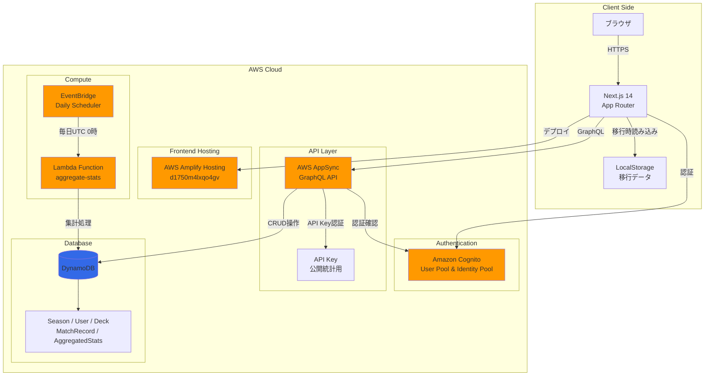

### 認証フロー

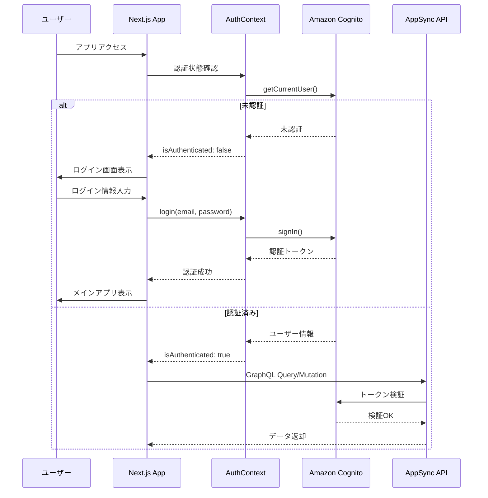

---

## 2. フロントエンドアーキテクチャ

### コンポーネント階層図

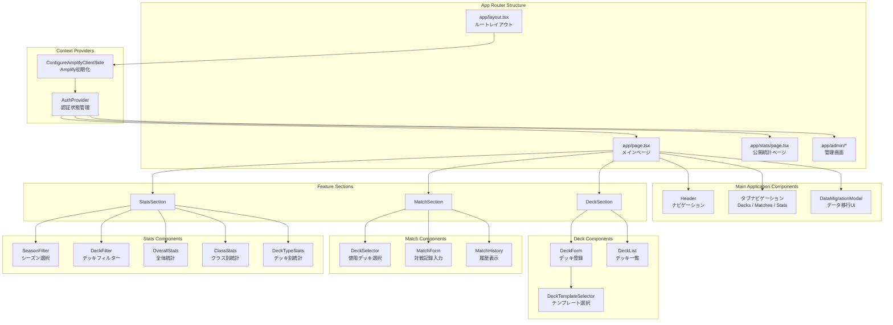

### 状態管理フロー

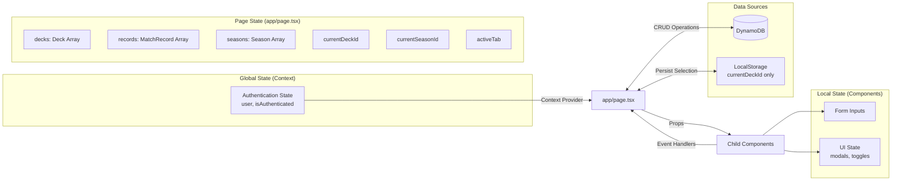

---

## 3. バックエンドアーキテクチャ

### AWS Amplifyバックエンド構成

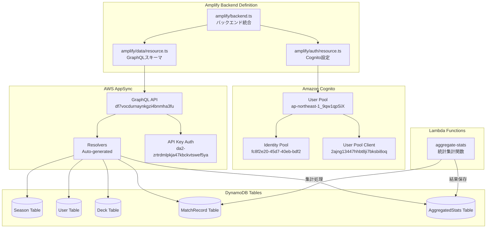

### データモデル関係図

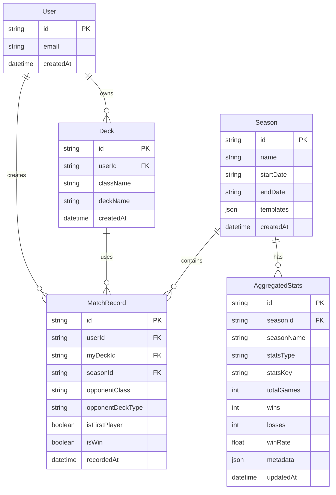

---

## 4. データフロー図

### CRUD操作フロー

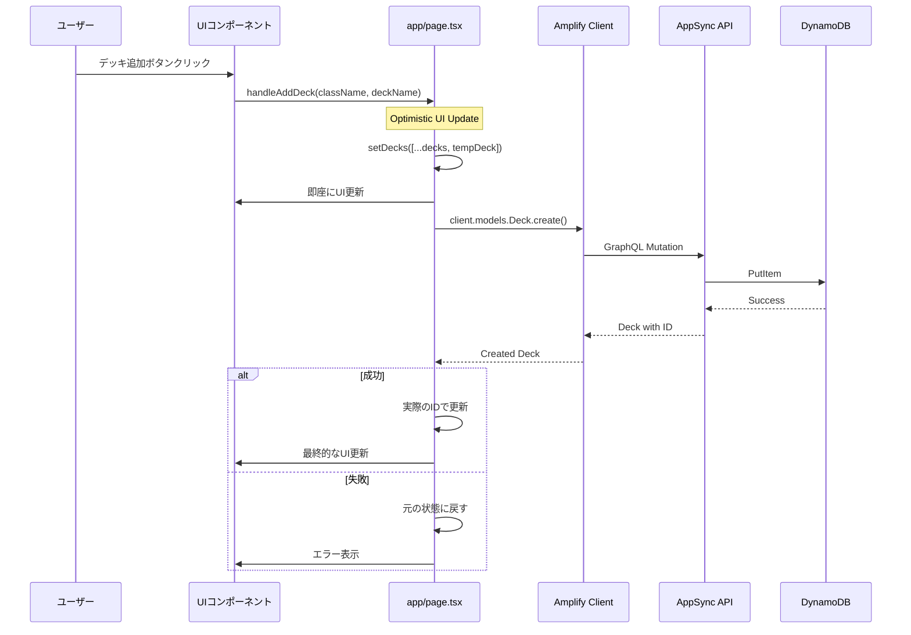

### LocalStorageデータ移行フロー

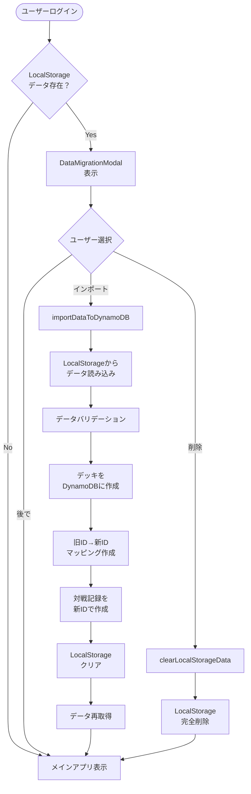

### 集計処理フロー

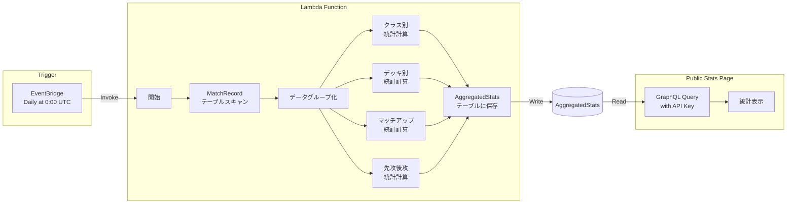

---

## 5. デプロイメントアーキテクチャ

### 現在のデプロイ構成

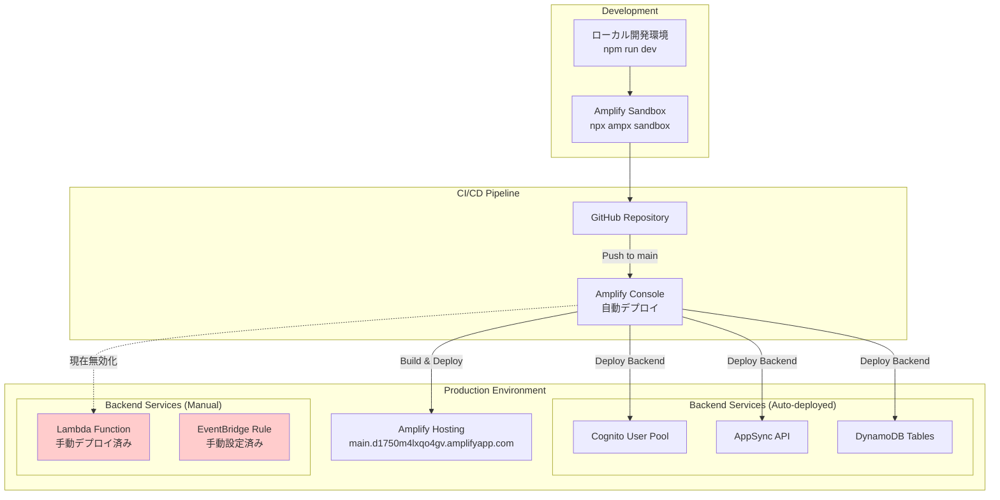

### 環境変数と設定

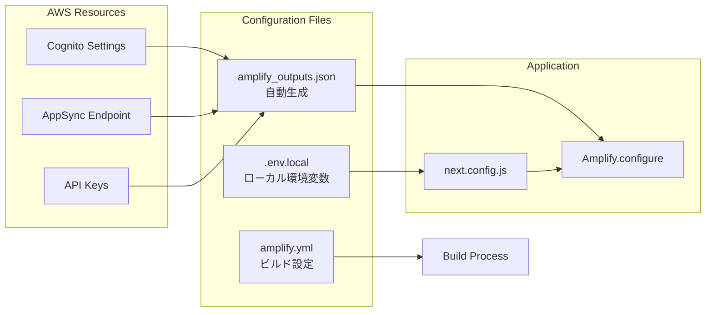

---

## 📊 アーキテクチャの特徴

### 強み
- **サーバーレス**: 完全なサーバーレスアーキテクチャで運用コスト最小化
- **スケーラブル**: AWS管理サービスによる自動スケーリング
- **型安全**: TypeScript + GraphQLによる型安全性
- **認証統合**: Cognitoによるセキュアな認証
- **リアルタイム対応**: AppSync Subscriptionsで将来的にリアルタイム機能追加可能

### 現在の課題
- Lambda関数の自動デプロイが無効化されている
- API Keyがコードにハードコード
- 一部のページで直接fetch()を使用（Amplifyクライアントを回避）

### 改善提案
1. Lambda関数のTypeScript設定を修正してCI/CD復旧
2. API KeyをAWS Systems Manager Parameter Storeで管理
3. Amplifyクライアントの認証モード切り替えを修正
4. CloudWatchによる監視とアラートの設定

---

## 🔄 更新履歴

- **2025-11-10**: 初版作成
- 現在のアーキテクチャ状態を反映
- AWS Amplify Gen2への移行完了状態を記載
- Lambda関数の手動デプロイ状況を明記